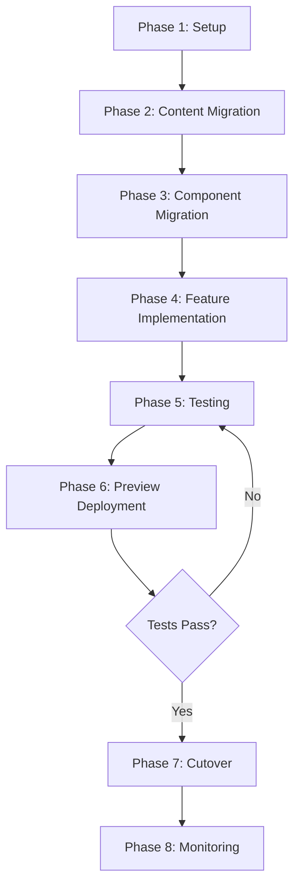

# Design Document: Astro Migration

## Overview

This design outlines the migration of Technical Anxiety blog from Jekyll to Astro, with a focus on ensuring content parity, feature parity, and a safe cutover process. The migration will be implemented incrementally, with comprehensive testing at each stage.

## Architecture

### Current Jekyll Architecture
```
technicalanxiety.github.io/
├── _config.yml          # Site configuration
├── _posts/              # Markdown blog posts
├── _pages/              # Static pages
├── _includes/           # Reusable HTML partials
├── _layouts/            # Page templates
├── _sass/               # SCSS stylesheets
├── js/                  # JavaScript files
├── img/                 # Images and assets
└── index.html           # Homepage
```

### Target Astro Architecture
```
astro-site/
├── astro.config.mjs     # Astro configuration
├── src/
│   ├── content/
│   │   └── posts/       # Migrated blog posts (MDX/MD)
│   ├── components/      # Astro/React components
│   ├── layouts/         # Page layouts
│   ├── pages/           # Route pages
│   └── styles/          # CSS/SCSS
├── public/              # Static assets (images, favicon)
└── package.json
```

### Migration Strategy



## Components and Interfaces

### Core Components to Migrate

| Jekyll Component | Astro Equivalent | Notes |
|-----------------|------------------|-------|
| `_includes/header.html` | `src/components/Header.astro` | Navigation, theme toggle |
| `_includes/footer.html` | `src/components/Footer.astro` | Social links, copyright |
| `_includes/sidebar.html` | `src/components/Sidebar.astro` | Author bio, recent posts |
| `_includes/hero.html` | `src/components/Hero.astro` | Homepage hero section |
| `_includes/table-of-contents.html` | `src/components/TableOfContents.astro` | Auto-generated TOC |
| `_includes/series-navigation.html` | `src/components/SeriesNavigation.astro` | Series prev/next |
| `_includes/giscus-comments.html` | `src/components/GiscusComments.astro` | Comment integration |
| `_includes/cookie-consent.html` | `src/components/CookieConsent.astro` | GDPR compliance |
| `_includes/reading-progress.html` | `src/components/ReadingProgress.astro` | Scroll progress bar |
| `_includes/reading-time.html` | Computed in frontmatter | Reading time calculation |
| `_includes/theme-toggle.html` | `src/components/ThemeToggle.astro` | Dark/light mode |
| `_includes/pagination.html` | `src/components/Pagination.astro` | Page navigation |
| `_includes/breadcrumbs.html` | `src/components/Breadcrumbs.astro` | Navigation breadcrumbs |
| `_includes/related-posts.html` | `src/components/RelatedPosts.astro` | Tag-based suggestions |

### Layout Structure

```astro
// src/layouts/BaseLayout.astro
---
import Header from '../components/Header.astro';
import Footer from '../components/Footer.astro';
import CookieConsent from '../components/CookieConsent.astro';
---
<html>
  <head>
    <SEO {...Astro.props} />
  </head>
  <body>
    <Header />
    <slot />
    <Footer />
    <CookieConsent />
  </body>
</html>
```

```astro
// src/layouts/PostLayout.astro
---
import BaseLayout from './BaseLayout.astro';
import TableOfContents from '../components/TableOfContents.astro';
import ReadingProgress from '../components/ReadingProgress.astro';
import SeriesNavigation from '../components/SeriesNavigation.astro';
import GiscusComments from '../components/GiscusComments.astro';
---
<BaseLayout {...Astro.props}>
  <ReadingProgress />
  <Breadcrumbs />
  <article>
    <TableOfContents headings={headings} />
    <slot />
    <SeriesNavigation series={series} />
  </article>
  <GiscusComments />
</BaseLayout>
```

## Data Models

### Post Frontmatter Schema

```typescript
// src/content/config.ts
import { defineCollection, z } from 'astro:content';

const postsCollection = defineCollection({
  type: 'content',
  schema: z.object({
    title: z.string(),
    date: z.date(),
    tags: z.array(z.string()).optional(),
    series: z.string().optional(),
    series_order: z.number().optional(),
    image: z.string().optional(),
    description: z.string().optional(),
    author: z.string().default('Jason Rinehart'),
    draft: z.boolean().default(false),
  }),
});

export const collections = {
  posts: postsCollection,
};
```

### Site Configuration

```typescript
// src/config.ts
export const siteConfig = {
  title: 'Technical Anxiety | Experience Blog',
  description: 'A technical blog covering Azure, Log Analytics, leadership, and navigating anxiety in tech.',
  url: 'https://technicalanxiety.com',
  author: {
    name: 'Jason Rinehart',
    avatar: '/img/me.jpg',
    bio: 'Cloud architect and technical leader sharing experiences with Azure, leadership, and mental health in tech.',
    twitter: 'anxiouslytech',
    linkedin: 'rinehart76',
  },
  giscus: {
    repo: 'technicalanxiety/technicalanxiety.github.io',
    repoId: 'MDEwOlJlcG9zaXRvcnkyMzIzNDc1NDk=',
    category: 'Comments',
    categoryId: 'DIC_kwDODdlXnc4Cx09X',
  },
  googleAnalytics: 'G-2HB2W9WDMR',
  postsPerPage: 7,
};
```

## Correctness Properties

*A property is a characteristic or behavior that should hold true across all valid executions of a system—essentially, a formal statement about what the system should do. Properties serve as the bridge between human-readable specifications and machine-verifiable correctness guarantees.*

### Property 1: Post Content Preservation

*For any* blog post in the Jekyll `_posts` directory, the Astro site SHALL render a corresponding page with matching title, date, tags, and content.

**Validates: Requirements 1.1, 1.2**

### Property 2: Series Navigation Consistency

*For any* post that belongs to a series, the series navigation component SHALL display correct previous/next links based on `series_order`, and all links SHALL resolve to valid pages.

**Validates: Requirements 1.3**

### Property 3: Reading Time Calculation

*For any* post, the displayed reading time SHALL be proportional to the word count (approximately 200-250 words per minute).

**Validates: Requirements 1.4**

### Property 4: Tag Page Linking

*For any* post with tags, each tag SHALL link to a tag page that lists all posts with that tag.

**Validates: Requirements 1.5**

### Property 5: Theme Toggle Round-Trip

*For any* theme state (light or dark), toggling the theme twice SHALL return to the original state, and the preference SHALL persist across page loads.

**Validates: Requirements 2.2**

### Property 6: Code Block Syntax Highlighting

*For any* code block with a language specifier, the rendered HTML SHALL contain syntax highlighting markup (CSS classes for tokens).

**Validates: Requirements 2.5**

### Property 7: Search Result Relevance

*For any* search query that matches text in a post's title or content, the search results SHALL include that post.

**Validates: Requirements 3.1**

### Property 8: Table of Contents Generation

*For any* post containing h2 or h3 headings, the table of contents SHALL contain anchor links to each heading.

**Validates: Requirements 3.2**

### Property 9: Pagination Validity

*For any* paginated page, the pagination controls SHALL link to valid previous/next pages, and the total page count SHALL equal ceil(totalPosts / postsPerPage).

**Validates: Requirements 3.6**

### Property 10: Breadcrumb Navigation

*For any* post page, breadcrumbs SHALL display a valid path from home to the current page.

**Validates: Requirements 3.7**

### Property 11: Meta Tag Completeness

*For any* page, the HTML head SHALL contain title, description, og:title, og:description, og:image, twitter:card, and canonical URL meta tags.

**Validates: Requirements 4.1, 4.2**

### Property 12: URL Structure Preservation

*For any* post, the Astro URL SHALL match the Jekyll URL format (`:title/`), ensuring no broken links from external sources.

**Validates: Requirements 4.3**

## Error Handling

### Build-Time Errors

| Error Type | Handling Strategy |
|------------|-------------------|
| Invalid frontmatter | Fail build with descriptive error message |
| Missing required fields | Fail build, list missing fields |
| Broken internal links | Warn during build, fail in CI |
| Missing images | Warn during build, use placeholder |

### Runtime Errors

| Error Type | Handling Strategy |
|------------|-------------------|
| 404 Not Found | Display custom 404 page with search and navigation |
| Giscus load failure | Graceful degradation, show "Comments unavailable" |
| Search index failure | Fallback to basic search or disable |
| Theme toggle failure | Default to system preference |

## Testing Strategy

### Dual Testing Approach

This migration requires both **unit tests** for specific component behavior and **property-based tests** for universal correctness guarantees.

### Unit Tests

Unit tests will verify specific examples and edge cases:

- Component rendering with various props
- Edge cases (empty tags, no series, missing images)
- Error conditions (invalid frontmatter, missing files)
- Integration points (Giscus loading, search indexing)

### Property-Based Tests

Property-based tests will verify universal properties using **fast-check** (JavaScript PBT library):

```typescript
// Example property test structure
import fc from 'fast-check';

// Property 1: Post Content Preservation
test('all Jekyll posts have corresponding Astro pages', () => {
  fc.assert(
    fc.property(fc.constantFrom(...jekyllPosts), (post) => {
      const astroPage = findAstroPage(post.slug);
      return astroPage !== null && 
             astroPage.title === post.title &&
             astroPage.date === post.date;
    }),
    { numRuns: 100 }
  );
});
```

### Test Configuration

- **Framework**: Vitest with fast-check for property-based testing
- **Minimum iterations**: 100 per property test
- **Tag format**: `Feature: astro-migration, Property N: [property description]`

### Manual Testing Checklist

Before cutover, manually verify:

- [ ] Visual comparison at desktop, tablet, mobile breakpoints
- [ ] Dark/light theme appearance
- [ ] Lighthouse audit scores (90+ target)
- [ ] All external links work
- [ ] Social sharing cards render correctly
- [ ] RSS feed validates and displays in readers

### Preview Deployment Testing

1. Deploy to Netlify/Vercel preview URL
2. Run automated link checker
3. Compare screenshots with Percy or similar
4. Test on multiple browsers (Chrome, Firefox, Safari)
5. Test on mobile devices

## Rollback Plan

### Pre-Cutover Preparation

1. Tag current Jekyll site as `pre-astro-migration`
2. Document current deployment configuration
3. Ensure Jekyll build still works independently

### Rollback Procedure

If critical issues discovered post-cutover:

1. Revert GitHub Pages to Jekyll branch (< 5 minutes)
2. Or: Update DNS/deployment to point to Jekyll build
3. Document issues for resolution
4. Re-attempt cutover after fixes

### Success Criteria for Cutover Completion

- 24 hours with no critical issues
- All Lighthouse scores maintained
- No increase in 404 errors in analytics
- Giscus comments functioning
- Search working correctly
