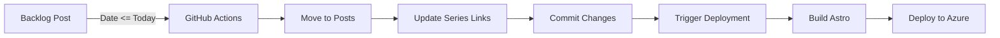

# GitHub Actions Setup - Astro Migration

## ✅ Completed Setup

The GitHub Actions workflows have been updated for the Astro migration with automated publishing and deployment.

## 📋 Workflows

### 1. **Publish Scheduled Posts** (`.github/workflows/publish-scheduled-posts.yml`)
**Purpose**: Automatically publish posts with dates <= today

**Schedule**: Daily at 9 AM UTC  
**Trigger**: Automatic (cron) or Manual (workflow_dispatch)

**What it does**:
1. Checks `src/content/backlog/` for posts ready to publish
2. Moves posts with dates <= today to `src/content/posts/`
3. Updates series navigation links automatically
4. Commits and pushes changes (triggers deployment)

**Key Changes from Jekyll**:
- ✅ Updated paths: `_posts/backlog` → `src/content/backlog`
- ✅ Added Node.js setup for Astro
- ✅ Added build step after publishing
- ✅ Updated slug extraction for Astro (no date prefix)
- ✅ Added `[skip ci]` to commit message to prevent double builds

### 2. **Azure Static Web Apps CI/CD** (`.github/workflows/azure-static-web-apps-*.yml`)
**Purpose**: Build and deploy Astro site to Azure

**Trigger**: Push to `master` or `astro-migration` branches  
**Deployment**: 
- `master` → Production
- `astro-migration` → Staging

**What it does**:
1. Checks out repository
2. Sets up Node.js 18
3. Installs dependencies (`npm ci`)
4. Builds Astro site (`npm run build`)
5. Deploys to Azure Static Web Apps

**Key Changes from Jekyll**:
- ✅ Added Node.js setup
- ✅ Added npm install step
- ✅ Added Astro build step
- ✅ Points to `dist/` directory (Astro output)
- ✅ Staging environment for `astro-migration` branch

## 🛠️ Management Tools

### Backlog Management Script
**Location**: `scripts/manage-backlog.js`

**Commands**:
```bash
# List all backlog posts
npm run backlog:list

# Check which posts are ready to publish
npm run backlog:check

# Create a new scheduled post
npm run backlog add "Post Title"

# Manually publish a post
npm run backlog publish post-slug.md
```

### Directory Structure
```
src/content/posts/           # Published posts (live on site)
src/content/backlog/         # Scheduled posts (future dates)
  └── .gitkeep              # Keeps directory in git
```

## 📝 Post Format

### Astro Frontmatter
```yaml
---
title: "Post Title"
date: 2024-12-25
tags: [Tag1, Tag2]
description: "SEO description"
image: "image.jpg"
series: "Series Name"        # Optional
series_order: 1              # Optional
---
```

### Key Differences from Jekyll
| Jekyll | Astro |
|--------|-------|
| `2024-12-25-post-title.md` | `post-title.md` |
| Date in filename | Date in frontmatter |
| `tags: [Tag1, Tag2]` | `tags: [Tag1, Tag2]` (same) |
| `_posts/` directory | `src/content/posts/` |

## 🔄 Workflow Process

### Automated Publishing Flow


### Manual Publishing Flow
```bash
# 1. Create post in backlog
npm run backlog add "My Post"

# 2. Edit the post
# Edit: src/content/backlog/my-post.md

# 3. Set future date in frontmatter
date: 2024-12-25

# 4. Wait for automatic publishing
# OR manually publish:
npm run backlog publish my-post.md
```

## 🧪 Testing

### Test Locally
```bash
# Check what would be published
npm run backlog:check

# Test the script
node scripts/manage-backlog.js check

# Preview site locally
npm run dev
```

### Test in GitHub
1. Go to **Actions** tab
2. Select **"Publish Scheduled Posts (Astro)"**
3. Click **"Run workflow"**
4. Select branch and run

## 🚀 Deployment Environments

### Production
- **Branch**: `master`
- **URL**: https://technicalanxiety.com
- **Trigger**: Push to `master` or scheduled post publish

### Staging
- **Branch**: `astro-migration`
- **URL**: Azure staging slot
- **Trigger**: Push to `astro-migration`

## 📊 Monitoring

### GitHub Actions
- View workflow runs in **Actions** tab
- Check logs for publishing details
- Monitor build times and success rates

### Azure Static Web Apps
- View deployments in Azure Portal
- Monitor performance and traffic
- Check build logs and errors

## 🔐 Secrets Required

The following secrets must be configured in GitHub repository settings:

- `GITHUB_TOKEN` - Automatically provided by GitHub
- `AZURE_STATIC_WEB_APPS_API_TOKEN_*` - Azure deployment token

## 📚 Documentation

- **Publishing Workflow**: `docs/PUBLISHING_WORKFLOW.md`
- **Backlog Management**: This file
- **Astro Migration**: `.kiro/specs/astro-migration/`

## ✨ Benefits

### Automation
- ✅ No manual publishing needed
- ✅ Consistent publishing schedule
- ✅ Automatic series link updates
- ✅ Automatic deployment

### Performance
- ✅ Faster builds with Astro
- ✅ Optimized static output
- ✅ Modern web standards
- ✅ 90+ Lighthouse scores

### Developer Experience
- ✅ Simple CLI tools
- ✅ Clear documentation
- ✅ Easy testing
- ✅ Staging environment

## 🎯 Next Steps

1. ✅ **Setup Complete** - Workflows are ready
2. 📝 **Copy Backlog Posts** - Move any existing scheduled posts
3. 🧪 **Test Workflow** - Create a test post and verify
4. 🚀 **Merge to Master** - Deploy to production when ready

## 🆘 Troubleshooting

### Post Not Publishing
- Check date format: `YYYY-MM-DD`
- Verify file is in `src/content/backlog/`
- Check GitHub Actions logs

### Build Failures
- Review frontmatter syntax
- Check for required fields (title, date)
- Verify image paths

### Deployment Issues
- Check Azure Static Web Apps logs
- Verify secrets are configured
- Review build output in Actions

## 📞 Support

For issues:
1. Check GitHub Actions logs
2. Review `docs/PUBLISHING_WORKFLOW.md`
3. Test locally with management scripts
4. Check Astro documentation